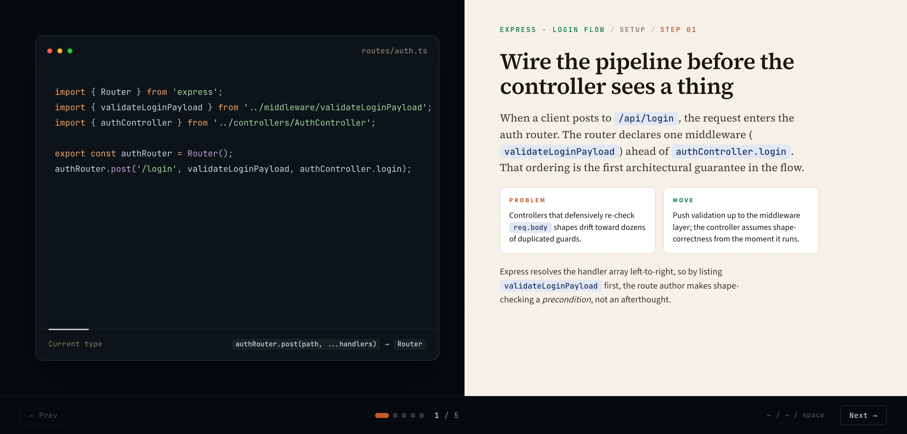

# code-storyteller

> Walk a reader through code one move at a time, like a director's commentary track on a screenplay.

A [Claude Code](https://claude.com/claude-code) skill that turns a code flow — or a GitHub PR diff — into a single self-contained HTML step-through. macOS-style code window on the left, serif narrative panel on the right. Advance with `←` / `→` / `space` / dots / Prev-Next.



> Open [`examples/sample-story.html`](./examples/sample-story.html) in a browser to see what it produces. Every artifact is one self-contained HTML file (~310 KB) with fonts, syntax highlighting, and the render engine inlined — works offline, share-friendly, no network calls at view time.

## What it produces

For each step the reader sees:

- **Left**: a macOS code window — traffic lights, monospace filename, dark navy background, Prism syntax highlighting, and a *Current type* footer that surfaces the function signature or PR before→after type with code chips.
- **Right**: a cream narrative panel — a compact breadcrumb (`STORY / Chapter / STEP NN`), a 36 px serif headline, a serif body paragraph, side-by-side **Problem** (orange) and **Move** (green) cards, and a sans-serif closing paragraph.
- **Footer rail**: `← Prev` · dot indicators · `N / total` counter · `Next →`. Keyboard: `←`, `→`, `space`, `Home`, `End`. URL hash `#3` deep-links to step 3.

Each step swaps the code, filename, type signature, headline, body, cards, and closing. The code window is a tape head; the narrative tells you what changed and why.

## Two modes

### 1. Default — narrate a flow in the working codebase

```
walk me through /api/login
tell the story of auth.ts
narrate the checkout flow
```

The skill reads `references/traversal-guide.md` for entry-point hints across **Express, NestJS, Next.js (App + Pages), FastAPI, Laravel, PayloadCMS, Rails, Spring, and Go**, traces the path, decomposes it into 4–10 *moves*, and renders.

### 2. `pr <id>` subcommand — narrate a PR diff

```
/code-storyteller pr 1234
/code-storyteller pr https://github.com/owner/repo/pull/1234
/code-storyteller pr 1234 --tone casual --out docs/pr-stories/
```

Fetches metadata via `gh pr view` and the diff via `gh pr diff`, decomposes into moves, and renders with diff syntax highlighting (`+` lines green, `-` lines red, `@@ … @@` headers in italic blue).

### Flags (both modes)

| Flag | Meaning |
|---|---|
| `--out <path>` | Output location override (file or directory). Default: `.claude-stories/YYYY-MM-DD-<slug>.html` in the project root. |
| `--tone {technical\|casual\|tutorial}` | Narrative tone. Default: `technical`. |
| `--no-open` | Skip auto-open in the browser. |

## Install

Requirements:
- [Claude Code](https://claude.com/claude-code) (this is a Claude Code skill)
- `python3` on `PATH` (used by the rendering pipeline)
- `gh` CLI authenticated (`gh auth login`) — only needed for `pr` mode

Clone the repo into your global Claude Code skills folder:

```bash
git clone https://github.com/tobidsn/code-storyteller.git ~/.claude/skills/code-storyteller
```

That's it. The next Claude Code session picks up the skill automatically — natural-language phrases like *"walk me through this endpoint"* or `/code-storyteller pr 1234` will trigger it.

To update later:

```bash
cd ~/.claude/skills/code-storyteller && git pull
```

## Authoring model — the `STORY` object

Every rendered file is driven by a single JSON object substituted into `template.html`:

```js
const STORY = {
  title: "EXPRESS · LOGIN FLOW",      // green mono caps, top of every step
  steps: [
    {
      chapter: "Setup",                // optional uppercase chapter label
      filename: "routes/auth.ts",
      lang: "typescript",              // optional; default "typescript"
      code: "router.post('/login', …)",// raw source — Prism highlights at runtime
      typeline: "`Router.post(...)` → `Router`",
      title: "Wire the pipeline before the controller sees a thing",
      body: "When a client posts to `/api/login`, …",
      problem: "Controllers that defensively re-check `req.body` shapes …",
      move: "Push validation up to the middleware layer; …",
      closing: "Express resolves the handler array left-to-right, …" // optional
    },
    // ... 4–10 steps total ...
  ],
};
```

Inline formatting in narrative strings (everything except `code`):

| Markdown | Renders as |
|---|---|
| `` `Identifier` `` | inline code chip (warm tan) |
| `*italic*` | *italic* (Source Serif italic) |
| `**bold**` | **bold** (Source Serif 600) |

Adding a step = pushing one object onto `steps`. The chapter rule and closing paragraph auto-hide when blank. The Mermaid sequence diagram from earlier iterations is gone — every visual element exists *because* it serves the step-through.

## File structure

```
code-storyteller/
├── SKILL.md                       Skill definition (frontmatter + procedure)
├── template.html                  Pre-built step-through template (~310 KB)
├── README.md                      This file
├── LICENSE                        Apache 2.0
├── references/
│   ├── narration-style.md         Technical / casual / tutorial tone guide
│   └── traversal-guide.md         Entry-point hints per stack
├── examples/
│   ├── build-sample.sh            Builds sample-story.html from the fixture
│   ├── sample-story.html          Quality target — open in a browser
│   └── _fixture/                  Tiny Express auth-flow fixture
└── tests/
    ├── build-template.py          Rebuilds template.html from CSS + fonts + Prism + render JS
    ├── render-template.sh         Independent regression harness
    └── _assets/                   Inlined fonts (woff2) + Prism components
```

`template.html` is committed pre-built so the skill works the moment the repo is cloned. Rebuild it whenever the CSS, fonts, or Prism components change:

```bash
python3 tests/build-template.py
./examples/build-sample.sh        # regenerates the sample alongside
```

## Typography

All inlined as base64 woff2 — fully self-contained:

- **Source Serif 4** (variable) — headline + body
- **Source Sans 3** (variable) — cards + closing + UI
- **JetBrains Mono** (variable) — code, filename, breadcrumb, type bar, footer

## What it is for

- Library walk-throughs and onboarding docs
- Refactor postmortems ("how this gnarly function got that way")
- PR walk-throughs for code-review prep or post-merge documentation
- Conference-talk handouts
- Design-doc appendices

The goal is for a reader to scrub through the steps and feel they understand not just *what* the final code does but *which moves got it there* and *why each one was made*.

## License

[Apache 2.0](./LICENSE).

## Acknowledgements

- Built as a [Claude Code](https://claude.com/claude-code) skill.
- Syntax highlighting via [Prism.js](https://prismjs.com/).
- Fonts: [Source Serif 4](https://github.com/adobe-fonts/source-serif), [Source Sans 3](https://github.com/adobe-fonts/source-sans), [JetBrains Mono](https://www.jetbrains.com/lp/mono/) — all open-source.
